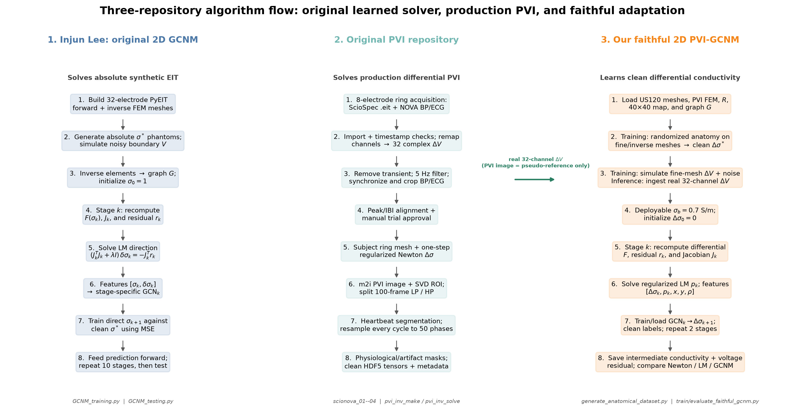

# 2D PVI-GCNM Presentation Outline

Recommended length: four main slides, with one optional conclusions slide.

---

## Slide 1 — Original 2D Graph-Convolutional Newton Method

### Problem being solved

- Reconstruct a two-dimensional conductivity distribution from boundary EIT
  voltages.
- The inverse problem is nonlinear, ill-conditioned, and underdetermined.
- Original experimental setup: 32 electrodes, 928 voltage measurements, and
  synthetic ellipse phantoms.

### Physics update

At iteration or learned stage $k$, the original code computes the nonlinear
voltage residual

$$
r_k = F(\sigma_k)-V_{\mathrm{meas}},
$$

where $F(\sigma_k)$ is the FEM forward solution for the current conductivity
estimate $\sigma_k$. The Jacobian is

$$
J_k = \left.\frac{\partial F}{\partial \sigma}\right|_{\sigma_k}.
$$

A regularized Levenberg--Marquardt/Newton direction is then obtained from

$$
p_k
=
-\left(J_k^{\mathsf T}J_k+\lambda I\right)^{-1}
J_k^{\mathsf T}r_k.
$$

Equivalently, it solves the normal equation

$$
\left(J_k^{\mathsf T}J_k+\lambda I\right)p_k
=-J_k^{\mathsf T}r_k.
$$

### Graph-network update

Each FEM element becomes a graph node. Mesh-neighboring elements are connected by
graph edges. The GCN receives the current conductivity and physics proposal:

$$
H_k=[\sigma_k,p_k].
$$

A separate GCN is trained for each stage:

$$
\sigma_{k+1}
=
\operatorname{GCN}_{\theta_k}(H_k,G).
$$

### Main message

> Original GCNM is a learned iterative inverse solver. It does not directly map
> voltages to an image: physics first proposes an update, and the graph network
> learns how that update should be spatially regularized on the FEM mesh.

Suggested visual:
[`algorithm_flow.pdf`](reports/gcnm_pvi_latex/figures/algorithm_flow.pdf)

This figure now places all three repositories in execution order: Injun's original
2D GCNM, the production PVI repository, and our faithful PVI-GCNM adaptation.



---

## Slide 2 — Peripheral Vascular Impedance Imaging

### Problem being solved

- Estimate pulsatile conductivity changes inside a limb using an eight-electrode
  wearable ring.
- Subject 6 uses the US120 ring geometry.
- The inverse mesh contains 1,330 elements, but each frame contains only 32 voltage
  measurements.

The measurement-to-unknown ratio is therefore

$$
\frac{32}{1330}\approx 0.024.
$$

The differential forward problem is

$$
\Delta V
=
F(\sigma_b+\Delta\sigma)-F(\sigma_b),
$$

where

- $\sigma_b$ is the baseline conductivity;
- $\Delta\sigma$ is the pulsatile conductivity change; and
- $\Delta V$ is the measured boundary-voltage change.

For a small conductivity change, the linear approximation is

$$
\Delta V\approx J(\sigma_b)\Delta\sigma.
$$

### Original PVI processing pipeline

```text
ScioSpec acquisition
        ↓
Channel remapping and temporal filtering
        ↓
32 differential-voltage measurements
        ↓
One-step regularized Newton inverse
        ↓
1,330-element conductivity estimate
        ↓
40 × 40 PVI visualization
```

### Production inverse

The original PVI reconstruction approximately solves

$$
\widehat{\Delta\sigma}_{\mathrm{Newton}}
=
\left(J^{\mathsf T}J+h_{\mathrm{PVI}}^2R\right)^{-1}
J^{\mathsf T}\Delta V,
$$

where $R$ is the projected spatial regularizer.

### Verified implementation

- Forward mesh: 5,320 elements.
- Inverse mesh: 1,330 elements.
- MATLAB/Python comparison over 500 frames:
  - image correlation: $0.9936$;
  - finite-mask intersection over union: $1.000$.

### Main limitation

> The production Newton reconstruction is useful as a physics baseline, but it is
> noisy and diffuse. It is also not anatomical ground truth, so training only to
> reproduce PVI images cannot demonstrate improved vessel recovery.

Suggested visual:
[`measurement_comparison.pdf`](reports/gcnm_pvi_latex/figures/measurement_comparison.pdf)

---

## Slide 3 — Our Faithful PVI-GCNM Adaptation

### What we changed

- Replaced the original PyEIT model with the PVI complete-electrode FEM solver.
- Changed the reconstruction target from absolute conductivity $\sigma$ to
  differential vascular conductivity $\Delta\sigma$.
- Used clean synthetic vessel conductivity as supervision instead of noisy PVI
  Newton images.
- Generated voltages on a 5,320-element forward mesh and reconstructed on a
  separate 1,330-element inverse mesh to reduce the inverse crime.
- Used the same deployable homogeneous baseline in training and inference:

$$
\sigma_b=0.7\ \mathrm{S/m}.
$$

- Restored the defining original-GCNM mechanism: nonlinear physics is recomputed
  after every learned stage.

### Stage 1: nonlinear differential prediction

For the current estimate $\Delta\sigma_k$,

$$
\widehat{\Delta V}_k
=
F(\sigma_b+\Delta\sigma_k)-F(\sigma_b).
$$

The voltage residual is

$$
r_k
=
\widehat{\Delta V}_k-\Delta V_{\mathrm{meas}}.
$$

### Stage 2: recompute the Jacobian

$$
J_k
=
\left.\frac{\partial F}{\partial \sigma}
\right|_{\sigma_b+\Delta\sigma_k}.
$$

### Stage 3: compute the physical proposal

The implemented LM direction solves

$$
\left(
J_k^{\mathsf T}J_k
+h_{\mathrm{PVI}}^2R
+\lambda_{\mathrm{LM}}I
\right)p_k
=
-J_k^{\mathsf T}r_k.
$$

### Stage 4: graph update

The faithful-core graph features are

$$
H_k=[\Delta\sigma_k,p_k].
$$

The coordinate ablation adds the element centroid and radius:

$$
H_k=[\Delta\sigma_k,p_k,x,y,r].
$$

The direct-output model predicts

$$
\Delta\sigma_{k+1}
=
\operatorname{GCN}_{\theta_k}(H_k,G).
$$

The proposal-residual alternative predicts

$$
\Delta\sigma_{k+1}
=
\Delta\sigma_k+p_k+c_{\theta_k}(H_k,G).
$$

### Controlled experiments completed

- Iterative LM without a GCN.
- Direct versus proposal-residual output.
- With and without coordinates $(x,y,r)$.
- Vessel weights $\alpha\in\{0,1,2,4,8\}$.
- Background penalties $\beta\in\{0.25,0.5,1.0\}$.
- Saved anatomical oracle versus homogeneous deployable baseline.

The weighted reconstruction objective is

$$
\mathcal L_{\mathrm{reconstruction}}
=
\frac{1}{SK}
\sum_{s=1}^{S}\sum_{i=1}^{K}
w_{s,i}
\left(\widehat{\Delta\sigma}_{s,i}-\Delta\sigma^*_{s,i}\right)^2.
$$

The explicit background penalty is

$$
\mathcal L_{\mathrm{background}}
=
\beta
\frac{
\sum_{s,i}(1-m_{s,i})\widehat{\Delta\sigma}_{s,i}^{,2}
}{
\sum_{s,i}(1-m_{s,i})+\epsilon
}.
$$

Suggested visual:
[`faithful_ablation_comparison.pdf`](reports/gcnm_pvi_latex/figures/faithful_ablation_comparison.pdf)

---

## Slide 4 — Results and Reconstruction Examples

### Exact nonlinear synthetic holdout

The nonlinear holdout contains 32 independent fine-mesh phantoms that were not
used for training or checkpoint selection.

| Method | Image correlation $\uparrow$ | Image RMSE $\downarrow$ | Dice $\uparrow$ | Background RMS $\downarrow$ |
|---|---:|---:|---:|---:|
| Saved Newton | 0.265 | 0.00506 | 0.295 | 0.000626 |
| Iterative LM stage 2 | 0.291 | 0.00503 | 0.394 | 0.000589 |
| Earlier fixed-feature GCN stage 2 | 0.463 | 0.00541 | 0.359 | 0.002810 |
| Direct GCN + coordinates | **0.561** | 0.00444 | 0.471 | 0.000865 |
| Selected $\alpha=1,\beta=0.25$ | 0.557 | **0.00432** | **0.485** | 0.001276 |

### Metric definitions

Image RMSE is

$$
\operatorname{RMSE}
=
\sqrt{
\frac{1}{SK}
\sum_{s=1}^{S}\sum_{i=1}^{K}
\left(
\widehat{\Delta\sigma}_{s,i}-\Delta\sigma^*_{s,i}
\right)^2
}.
$$

Background RMS is

$$
\operatorname{BG\text{-}RMS}
=
\sqrt{
\frac{
\sum_{s,i}(1-m_{s,i})\widehat{\Delta\sigma}_{s,i}^{,2}
}{
\sum_{s,i}(1-m_{s,i})
}
}.
$$

Localization Dice at the true vessel volume is

$$
\operatorname{Dice}
=
\frac{
2\left|\widehat{\mathcal S}\cap\mathcal S^*\right|
}{
\left|\widehat{\mathcal S}\right|+\left|\mathcal S^*\right|
}.
$$

### Real subject-6 PVI evaluation

The selected model was evaluated on 1,600 phases from held-out trials 10 and 11.
The comparison target is the existing PVI Newton reconstruction, not anatomical
ground truth.

**Selected stage 1**

$$
\operatorname{corr}
(\widehat{\Delta\sigma}_{\mathrm{GCN1}},
\Delta\sigma_{\mathrm{PVI}})
=0.604.
$$

The mean physical voltage residual decreases:

$$
2.36\times10^{-5}
\longrightarrow
1.68\times10^{-5}.
$$

**Selected stage 2**

$$
\operatorname{corr}
(\widehat{\Delta\sigma}_{\mathrm{GCN2}},
\Delta\sigma_{\mathrm{PVI}})
=0.169.
$$

The voltage residual increases:

$$
1.68\times10^{-5}
\longrightarrow
2.63\times10^{-5}.
$$

### Main conclusion

> The faithful PVI-GCNM substantially improves structural recovery on synthetic
> nonlinear conductivity truth. However, the second stage does not transfer
> reliably to the real PVI domain. Intermediate representations and voltage
> consistency must therefore remain visible, and anatomical claims require an
> independent phantom or ultrasound reference.

Suggested visual:
[`faithful_output_gallery.pdf`](reports/gcnm_pvi_latex/figures/faithful_output_gallery.pdf)

---

## Optional Slide 5 — Conclusions and Next Steps

### What has been completed

- Subject-6 US120 ring geometry and production inverse reproduced.
- MATLAB/Python production parity verified.
- Clean anatomical synthetic supervision generated.
- Faithful per-stage PVI forward/Jacobian recomputation implemented.
- Iterative-LM, architecture, coordinate, vessel-weight, baseline, and background
  ablations completed.
- Synthetic ground-truth and full real-PVI output comparisons completed.

### Next scientific steps

1. Introduce physics-aware stopping so real inference can stop before stage-2
   voltage consistency deteriorates.
2. Run multiple random seeds and report confidence intervals.
3. Increase anatomical, electrode, contact-impedance, and acquisition-domain
   randomization.
4. Test additional subjects and ring geometries.
5. Validate vessel localization with a physical phantom and co-registered
   ultrasound.

Suggested visual:
[`faithful_real_pvi_gallery.pdf`](reports/gcnm_pvi_latex/figures/faithful_real_pvi_gallery.pdf)

---

# Current-state update deck — simple presentation version

This section is the recommended update for the current project meeting. The
language is deliberately conversational: the presenter can read the “talking
point” paragraphs without turning the slide into a methods paper.

## Slide 1 — The big picture

**On the slide**

> We are replacing the noisy Newton image representation used by the BP learner
> with a learned, mesh-aware reconstruction that still follows the PVI physics.

**Talking point**

The project has three connected parts. First, we generate realistic conductivity
beats. Second, the PVI forward FEM turns those conductivity changes into the
voltages that the electrodes would measure. Third, a GCNM learns the inverse map
from those voltages back to a conductivity representation. Only after those
three pieces agree do we train the BP models.

```text
conductivity beat → PVI forward FEM → HP/LP voltage → GCNM → image representation → BP model
```

The goal is not to make a pixel-for-pixel copy of Newton. Newton is our reference
pipeline, but the synthetic conductivity truth gives us a cleaner way to judge
whether the learned reconstruction is useful.

## Slide 2 — What we tried during the investigation

**On the slide**

- Clean ellipse and one-/two-vessel phantoms.
- Coordinate GCNMs and residual/proposal variants.
- Saved-anatomical and homogeneous baselines.
- Ten-stage unrolling, core-guided models, physics-calibrated models, and
  direction-anchored models.
- Spatial slots, global-voltage vessel slots, diffusion slots, and primitive
  coordinate models.
- Ring-specific packs and a 50-sample whole-beat generator.

**Talking point**

Each experiment answered a specific question: can coordinates help the network
separate vessels, can explicit vessel slots prevent merging, can diffusion model
the surrounding tissue, and can a better baseline transfer from synthetic data to
real PVI? Some models looked excellent on synthetic images but failed on real
voltage magnitude or painted broad background structure. Those are useful results:
they told us which inductive biases were not transferable.

## Slide 3 — The model families and their building blocks

### Coordinate GCNM

```text
measured voltage + current conductivity
        ↓
PVI forward solve and Jacobian
        ↓
LM/Newton proposal on the element graph
        ↓
GCN layers with x, y, r coordinate features
        ↓
signed dense conductivity field
        ↓
recompute physics → stage 2
```

The coordinate features give the graph an explicit notion of location. The output
is dense and signed, so negative conductivity changes are allowed. The selected
protocol uses two recomputed-physics stages, homogeneous (0.7\,\mathrm{S/m})
baseline, positive weight \(\alpha=1\), background weight \(\beta=0.25\), and
composite checkpoint selection.

### Global-voltage vessel-slot GCNM

```text
voltage waveform + graph/Jacobian features
        ↓
signed vessel localizer
        ↓
global voltage/RMS and beat geometry features
        ↓
vessel parameter refiner
        ↓
signed ellipse/halo fields on the mesh
```

The slots force the model to represent a small number of vessels explicitly:
centre, axes, angle, signed amplitude, diffusion fraction, and length. We chose
this because the inverse problem has very few measurements compared with mesh
elements; a structured vessel representation can be easier to identify than a
free dense image. The trade-off is that the model can impose its prior too
strongly, so we keep the literal stage outputs and voltage residuals visible.

### Diffusion-slot family

This family includes a voltage MLP and learned diffusion slots. It remains a
valuable comparison model, but it is parked for the current BP pilot while we
first establish the HP/LP contract with the coordinate and global-voltage-slot
families.

## Slide 4 — What happened with the losses

**On the slide**

| Loss or block | Why we tried it | What we learned |
|---|---|---|
| Element/image MSE | Basic conductivity accuracy | Allows diffuse or background shortcuts |
| Positive/background weighting | Emphasize vessel changes without painting the ring | Improves the useful foreground/background balance |
| Dice/localization | Encourage vessel support overlap | Helps structure, but can reward overly broad support |
| Slot separation | Keep two vessels apart | Reduces vessel merging; can become prior-driven |
| Attention | Let the model select informative measurements | Useful ablation, not a universal solution |
| Correlation | Match temporal/voltage shape | Helpful diagnostic; not enough by itself |
| Forward-voltage residual | Check physical consistency | Required to detect a visually plausible but physically wrong image |

**Talking point**

No single loss solved the problem. Image quality, vessel localization, and voltage
consistency measure different things. We therefore report all three instead of
choosing a model from one attractive image or one scalar loss.

## Slide 5 — Synthetic data: from a small phantom to the current pack

**On the slide**

- Earlier packs: simple ellipses, limited morphology, and frame-level sampling.
- Rejected generalized beat pack: retained only 4 or 10 frames per beat, not the
  required 50 samples per beat.
- Current US120 pack: 200 virtual anatomies, 1,000 complete beats, 50 samples per
  beat = 50,000 frames per HP/LP component.
- Split by anatomy: 800/100/100, with nonlinear validation and test anatomies.

**Talking point**

The improvement is not just “more samples.” Each sample is a complete beat with a
different anatomy and morphology. We vary vessel size, position, rotation,
waveform shape, asymmetry, timing, tissue conductivities, diffusion, and signed
amplitude. We also keep the train/validation/test split at the anatomy level so a
slightly modified copy of the same finger cannot appear in both partitions.

## Slide 6 — Why the first HP/LP image attempt failed

**On the slide**

```text
archived HP resistance ──ΔV = −IΔR──► HP voltage
                                      │
                                      └─► GCNM trained/output as absolute σ image
                                           └─ called “pviHP/pviLP”  ✗

archived LP resistance ──ΔV = −IΔR──► LP voltage
                                      │
                                      └─► GCNM trained/output as absolute σ image
                                           └─ called “pviLP/pviHP”  ✗
```

**Talking point**

The first export did convert the archived HP and LP resistance fields into voltage,
but it used those already-separated component voltages as if they were the complete
absolute voltage input for an absolute-conductivity GCNM. It then treated the two
learned GCNM stages as if they were the PVI HP and LP fields. Both assumptions were
wrong. A GCNM stage is an inverse reconstruction stage; HP and LP are temporal
components of the measured signal. The resulting images could look plausible, but
their meaning, magnitude, and morphology did not match what `pvi_ml` expects. We
stopped the export instead of training BP models on mislabeled fields.

### What PVI/Newton actually uses

The EIT instrument measures complex voltage:

\[
\mathbf{v}_{\mathrm{meas}}
=
\mathbf{v}_{\mathrm{real}}
+j\mathbf{v}_{\mathrm{imag}}.
\]

The acquisition software can express these as BioZ resistance and reactance:

\[
\mathbf{R}=-\frac{\mathbf{v}_{\mathrm{real}}}{I},
\qquad
\mathbf{X}=-\frac{\mathbf{v}_{\mathrm{imag}}}{I}.
\]

For the production PVI/Newton images, the inverse uses the **real/in-phase
voltage** (equivalently the resistance channel after conversion):

\[
\Delta\mathbf{v}_{\mathrm{real}}=-I\,\Delta\mathbf{R}.
\]

The reactance channel is not used to create the current PVI HP/LP images. It is
retained for BioZ/complex-impedance experiments. Therefore the HDF5 HP/LP
resistance fields are not a different modality from the voltage used by Newton;
they are the production representation of its real voltage channel. The HDF5
reactance fields are separate and are not part of this image path.

## Slide 7 — The fix: one GCNM for HP and one GCNM for LP

**On the slide**

```text
absolute conductivity beat σ(t)
        ↓ PVI forward FEM
absolute real electrode voltage vreal(t)
        ↓ production filter + 100-frame moving mean
V_HP = V_full − V_LP       V_LP = movmean(V_full, 100)
        ↓                         ↓
HP GCNM (two stages)         LP GCNM (two stages)
        ↓                         ↓
hp_s1, hp_s2                 lp_s1, lp_s2
```

**Talking point**

We now generate the continuous absolute physiology first. The forward FEM creates
the corresponding absolute real electrode voltage, and only then do we apply the
production temporal filter and moving-mean split. This keeps the HP and LP signals
physically coupled and preserves their relative magnitude. We then train two
independent component-specific GCNMs per architecture: one for HP and one for LP.
Each component GCNM still has two learned reconstruction stages, but those stages
are never renamed as HP or LP.

## Slide 8 — Why we used the HDF5 files first

**On the slide**

- The HDF5 files already contain accepted samples, BP waveforms, timing, masks,
  subject IDs, and HP/LP resistance fields.
- The raw ScioSpec archive is roughly 300 GB more data.
- Raw data still require alignment, filtering, segmentation, and manual acceptance.
- HDF5 lets us test the new representation on exactly the same windows as PVI ML.

**Talking point**

This is a controlled engineering decision, not a claim that raw EIT is unnecessary
forever. We use HDF5 to avoid changing the sample population while we test the
representation. A raw-data audit remains possible later, but it should not be
mixed into the first fair BP comparison.

## Slide 9 — Three channels versus six channels

**On the slide**

The existing image learner uses three effective channels:

\[
[\,\widehat{\Delta\sigma}_{HP},
\ \partial_t\widehat{\Delta\sigma}_{LP},
\ \partial_t^2\widehat{\Delta\sigma}_{LP}\,].
\]

Our first GCNM BP pilot uses:

\[
[\,s_2,\ \partial_t s_1,\ \partial_t^2s_1\,],
\]

where (s_1,s_2) are literal stages of the component-specific reconstruction.

The six-channel ablation would expose both literal stages for both components:

\[
[hp\_s1,hp\_s2,lp\_s1,lp\_s2]
\]

plus the corresponding temporal derivatives required by the learner. We start
with three channels to match the existing PVI-ML contract and only add six
channels if the pilot shows that the extra stage information helps.

## Slide 10 — The BP architecture we are testing now

**On the slide**

```text
Parquet sample (five periods × 50 frames)
        ↓
same pvi_ml sequence processing and derivatives
        ↓
CRT encoder/temporal transformer
        ↓
waveform head OR [DBP, SBP] head
```

**Talking point**

For the first comparison we keep the BP learner unchanged and change only the
image loader. The pilot uses CRT, because it is the requested first architecture,
with both waveform and fiducial targets. Fiducials use the original PVI-ML rule:
the minimum BP value is DBP and the maximum is SBP. We are running both coordinate
and global-voltage vessel-slot representations, first for subject006 and then for
subject010, with the same mask and frozen source windows.

## Slide 11 — Current state and what is running

**On the slide**

- Synthetic generation `432555`: completed; nonlinear validation passed.
- Four HP/LP GCNM trainings: completed training/evaluation.
- Manifest repair `432733`: completed after a filename bookkeeping failure.
- Parquet export `432737_[0-1]`: currently running for subject006/010.
- Real GIFs `432739_[0-7]`: waiting on export.
- CRT BP submission `432741`: waiting on export; it will submit 8 jobs.

**Talking point**

The relaunch was not caused by bad model quality. The models finished, but the
manifest recorder expected old generic checkpoint names instead of the new
component-specific names. We repaired the recorder and continued from the existing
checkpoints. The current decision will be based on the exported data, GIFs, and BP
metrics, and the final quality judgment remains open.

## Slide 12 — Next steps and decision points

1. Finish and validate both subject006/010 Parquet roots.
2. Inspect eight real GIFs against the archived Newton component references.
3. Run eight CRT BP pilots: two families × two targets × two subjects.
4. Compare waveform metrics and fiducial MAE/SD, tolerance rates, (R^2), and
   concordance correlation.
5. Decide whether the three-channel representation is enough.
6. If needed, run the six-channel ablation using the same windows and splits.
7. Only after the pilot decision, scale export and BP training to all rings and
   subjects.

**Closing message**

> We have moved from trying many inverse architectures to testing a clear,
> physically matched representation. The next result is not just a better-looking
> reconstruction; it is whether that representation gives the BP learner useful,
> repeatable information on the same samples used by PVI ML.
